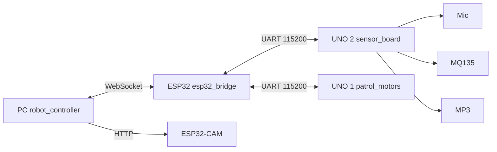

# Arquitectura dividida: ESP32 puente + Arduino sensores

Usa esta variante si **no puedes cablear mic, MQ135 y MP3 en la ESP32 dev**, pero sí tienes un **segundo Arduino UNO** como en [`examples/senores_example.ino`](examples/senores_example.ino).

El **mismo** `config.py` y `secrets.h` de la raíz sirven para ambas arquitecturas.

---

## Comparación

| | Arquitectura A (integrada) | Arquitectura B (dividida) |
|--|---------------------------|---------------------------|
| Sensores + MP3 | ESP32 dev (`robot_hub/`) | Arduino UNO #2 (`sensor_board/`) |
| WiFi + WebSocket | ESP32 dev | ESP32 dev (`esp32_bridge/`) |
| Motores | Arduino UNO #1 (`patrol_motors/`) | Igual |
| Cámara | ESP32-CAM | Igual |
| PC | `robot_controller.py` | Igual (sin cambios) |



---

## Firmware a flashear (arquitectura B)

| Placa | Sketch |
|-------|--------|
| ESP32 dev | [`esp32_bridge/esp32_bridge.ino`](esp32_bridge/esp32_bridge.ino) |
| Arduino UNO #2 | [`sensor_board/sensor_board.ino`](sensor_board/sensor_board.ino) |
| Arduino UNO #1 | [`patrol_motors/patrol_motors.ino`](patrol_motors/patrol_motors.ino) |
| ESP32-CAM | [`examples/send_images_wifi/`](examples/send_images_wifi/) |

---

## Cableado UART

### ESP32 bridge ↔ Arduino sensores (UNO #2)

| ESP32 | Arduino UNO #2 |
|-------|----------------|
| GPIO **19** (TX) | Pin **6** (RX) |
| GPIO **18** (RX) | Pin **7** (TX) |
| GND | GND |

Baud: **115200**, JSON por línea.

### ESP32 bridge ↔ Arduino motores (UNO #1)

| ESP32 | Arduino UNO #1 |
|-------|----------------|
| GPIO **17** (TX) | Pin **8** (RX) |
| GPIO **16** (RX) | Pin **9** (TX) |
| GND | GND |

(Igual que en `robot_hub` + `patrol_motors`.)

---

## Sensores en Arduino UNO #2 (como `senores_example.ino`)

| Señal | Pin UNO |
|-------|---------|
| Mic DO | **D2** |
| Mic AO | **A0** |
| MQ135 AO | **A1** |
| MP3 RX | **D8** |
| MP3 TX | **D9** (+ 1 kΩ a RX del MP3) |
| LED estado | **D13** |
| UART → ESP32 | **D6** RX, **D7** TX |

No se usa SD ni RTC del example; solo monitoreo + MP3 para el robot.

---

## Protocolo JSON

### Sensor board → ESP32 → PC

Mismos eventos que `robot_hub`:

```json
{"event":"heartbeat","air":380,"mic_ao":45,"mic_do":1,"patrol":"active","ts":12345}
{"event":"bark","air":412,"mic_ao":250,"mic_do":0,"ts":...}
{"event":"stopped","reason":"bark","ts":...}
{"event":"audio_played","ts":...}
```

Al detectar ladrido, el **sensor board** avisa al ESP32; el **ESP32** envía `{"cmd":"stop"}` al UNO de motores **de inmediato** y reenvía el evento a la PC.

### PC → ESP32 → sensor board

```json
{"cmd":"play_audio","track":1}
{"cmd":"ping"}
```

`play_audio` se reenvía al UNO #2, que reproduce con el DFPlayer.

---

## Puesta en marcha

1. `cp config.example.py config.py` y `cp secrets.h.example secrets.h` (raíz).
2. Flashea los cuatro firmwares de la tabla anterior.
3. PC:
   ```bash
   python robot_controller.py
   ```
   o para pruebas: `python debug/mock_controller.py`

4. Monitor USB del **sensor board** (115200): verás `[TX]` / `[RX]` para depurar UART.

---

## Depuración sin PC

- **Sensor board solo:** abre Monitor Serial 115200; verás heartbeats y `[TX]` JSON (el ESP32 no está conectado si no hay `[RX]`).
- **ESP32 bridge:** Monitor 115200; deberías ver `[SENSOR]` con líneas del UNO #2 y `[WS] Conectado` con el mock activo.

---

## Cuándo usar cada arquitectura

| Usa **robot_hub** (A) | Usa **esp32_bridge + sensor_board** (B) |
|-----------------------|----------------------------------------|
| Un solo ESP32 dev con pines libres | Ya tienes el kit cableado como `senores_example` en UNO |
| Robot compacto | Prefieres 5 V nativo en sensores (UNO) |
| Menos cables UART | Evitas divisor ADC 3.3 V en ESP32 |

Ver también: [`WIRING.md`](WIRING.md), [`debug/SENSORS.md`](debug/SENSORS.md).
