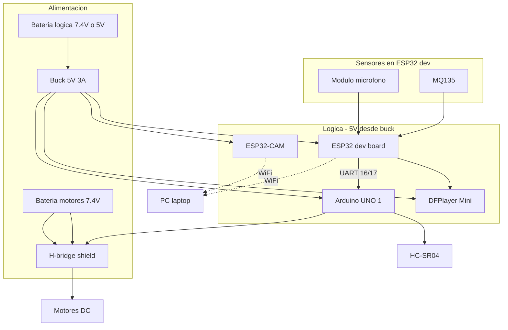

# Guía de cableado del robot patrullero

Documentación de conexiones físicas: sensores, audio, comunicación entre placas, alimentación y resistencias.

Firmware de referencia: [`robot_hub/robot_hub.ino`](robot_hub/robot_hub.ino), [`patrol_motors/patrol_motors.ino`](patrol_motors/patrol_motors.ino), [`examples/send_images_wifi/`](examples/send_images_wifi/).

---

## 1. Vista general del robot



| Placa | Función | Alimentación |
|-------|---------|--------------|
| **ESP32 dev board** | Mic, MQ135, DFPlayer, puente WiFi → PC, UART → UNO | 5 V (≥500 mA) |
| **Arduino UNO #1** | Motores, patrulla, HC-SR04 | 5 V o VIN 7–12 V vía buck |
| **ESP32-CAM** | Foto del plato (`/cam.jpg`) | 5 V estable (≥500 mA) |
| **PC** | Python, ML, Telegram | Red eléctrica / batería propia |

---

## 2. Mapa de pines completo

### ESP32 dev board (`robot_hub.ino`)

| Señal | GPIO ESP32 | Dirección | Notas |
|-------|------------|-----------|-------|
| Mic DO | **34** | Entrada digital | Solo entrada (input-only) |
| Mic AO | **35** | Entrada analógica | ADC1, compatible con WiFi |
| MQ135 AO | **32** | Entrada analógica | ADC1; DO del MQ135 no se usa |
| UART → UNO RX | **17** (TX) | Salida | Hacia pin 8 del UNO |
| UART ← UNO TX | **16** (RX) | Entrada | Desde pin 9 del UNO |
| DFPlayer RX ← | **19** (TX) | Salida | Hacia RX del MP3 |
| DFPlayer TX → | **18** (RX) | Entrada | Desde TX del MP3 |

### Arduino UNO #1 (`patrol_motors.ino` + H-bridge)

| Señal | Pin UNO | Notas |
|-------|---------|-------|
| Motor A PWM (ENA) | **5** | Shield H-bridge |
| Motor A IN1 / IN2 | **2** / **3** | |
| Motor B PWM (ENB) | **6** | |
| Motor B IN3 / IN4 | **4** / **7** | |
| HC-SR04 TRIG | **12** | |
| HC-SR04 ECHO | **13** | |
| UART ← ESP32 TX | **8** (RX) | SoftwareSerial |
| UART → ESP32 RX | **9** (TX) | SoftwareSerial |

### ESP32-CAM

| Señal | Conexión |
|-------|----------|
| 5 V | Buck 5 V (no desde pin 5 V del UNO) |
| GND | GND común del robot |
| Programación | FTDI USB‑serial (solo para flashear) |
| Datos | WiFi hacia la PC (`URL_CAM` en `config.py`) |

---

## 3. Módulo de micrófono (detección de ladrido)

Módulos típicos: **KY-037**, **KY-038** o similar (4 pines).

### Pines del módulo

| Pin módulo | Conectar a | Cable sugerido |
|------------|------------|----------------|
| **VCC** | 3.3 V o 5 V* | Rojo |
| **GND** | GND ESP32 | Negro |
| **DO** | GPIO **34** | Amarillo/verde |
| **AO** | GPIO **35** | Azul |

\* Ver sección [Resistencias y voltajes](#7-resistencias-divisores-y-voltajes).

### Esquema

```
Modulo MIC                ESP32 dev
┌──────────┐              ┌──────────┐
│ VCC      │──────────────│ 3V3 o 5V │
│ GND      │──────────────│ GND      │
│ DO       │──────────────│ GPIO 34  │
│ AO       │──────────────│ GPIO 35  │
└──────────┘              └──────────┘
```

### Ajuste del potenciómetro (módulo con tornillo)

- En **silencio**: `DO` debería estar en HIGH (1); `AO` bajo (~0–80 en escala 10 bit).
- En **ruido fuerte** (golpe, ladrido de prueba): `DO` pasa a LOW o `AO` supera ~200.
- Calibración fina: firmware `debug/esp32/test_sensors` y teclas `+` / `-` para el umbral.

### ¿Pull-up / resistencia en DO?

- En **Arduino UNO** (`senores_example.ino`): `pinMode(MIC_DO, INPUT)` sin pull-up interno; el módulo suele llevar comparador y pull en la placa.
- En **ESP32**: igual, `INPUT` sin pull-up. **No añadas resistencia** salvo que el datasheet de tu módulo lo exija.
- Si `DO` flota sin módulo conectado, leerá valores erráticos; es normal en banco de pruebas.

---

## 4. Sensor MQ135 (calidad del aire)

### Pines del módulo

| Pin módulo | Conectar a | Notas |
|------------|------------|-------|
| **VCC** | 5 V recomendado | El calentador del sensor usa 5 V |
| **GND** | GND ESP32 | |
| **AO** | GPIO **32** | Señal analógica |
| **DO** | *(no conectar)* | No se usa en este proyecto |

```
Modulo MQ135              ESP32 dev
┌──────────┐              ┌──────────┐
│ VCC      │──────────────│ 5V       │
│ GND      │──────────────│ GND      │
│ AO       │───[opcional divisor]───│ GPIO 32  │
│ DO       │   (no usado)           │
└──────────┘              └──────────┘
```

### Calentamiento

- Tras encender, espera **1–3 minutos** antes de confiar en la lectura (calentador interno).
- Calibración: [`CALIBRATION.md`](CALIBRATION.md).

---

## 5. DFPlayer Mini (MP3-TF-16P) + bocina

Basado en [`examples/senores_example.ino`](examples/senores_example.ino) y [`robot_hub/robot_hub.ino`](robot_hub/robot_hub.ino).

### Pines del módulo MP3

| Pin MP3 | Conectar a | Notas |
|---------|------------|-------|
| **VCC** | 5 V | Hasta ~500 mA al reproducir |
| **GND** | GND común | Ambos pads GND del módulo |
| **RX** | GPIO **19** vía **1 kΩ** | Recibe del TX del ESP32 |
| **TX** | GPIO **18** | Envía al RX del ESP32 |
| **SPK_1 / SPK_2** | Bocina 8 Ω 3 W (o similar) | Polaridad no crítica en mini bocinas |

### Cableado UART (cruzado)

```
ESP32 dev                    DFPlayer Mini
GPIO 19 (TX) ────[ 1 kΩ ]───► RX
GPIO 18 (RX) ◄──────────────── TX
GND ────────────────────────── GND
5V  ────────────────────────── VCC
```

### micro-SD del MP3

- Formato **FAT32**.
- Archivo de voz del dueño: **`0001.mp3`** en la raíz (track 1).
- La SD va **dentro del módulo MP3**, no en la SD SPI del example de Arduino.

### Resistencia de 1 kΩ — ¿obligatoria?

| Situación | Recomendación |
|-----------|----------------|
| ESP32 3.3 V → MP3 RX | **Sí, 1 kΩ en serie** en la línea TX→RX (recomendación [DFRobot](https://wiki.dfrobot.com/dfr0299/)) |
| Arduino 5 V → MP3 RX | **Sí, 1 kΩ** (como en `senores_example.ino`) |
| Solo prueba en protoboard | Puede funcionar sin ella; para montaje final **pon la resistencia** |

No hace falta resistencia en la línea **MP3 TX → ESP32 RX** (3.3 V lógico).

---

## 6. UART entre ESP32 dev y Arduino UNO #1

Comunicación JSON a **115200 baud**. **GND común obligatorio.**

```
ESP32 dev          Cable          Arduino UNO #1
GPIO 17 (TX) ──────────────────► Pin 8  (RX)
GPIO 16 (RX) ◄────────────────── Pin 9  (TX)
GND ───────────────────────────── GND
```

| Detalle | Valor |
|---------|-------|
| Baudrate | 115200 |
| Formato | JSON por línea, ej. `{"cmd":"stop"}` |
| Nivel lógico | 3.3 V (ESP32) ↔ 5 V (UNO) — tolerado en la mayoría de placas UNO en RX |

### ¿Resistencia en UART UNO ↔ ESP32?

- **No es necesaria** en la práctica para RX del ESP32 desde TX del UNO (5 V → 3.3 V). Si quieres máxima protección del ESP32, divisor **2.2 kΩ + 3.3 kΩ** en la línea UNO TX → ESP32 RX (opcional, no incluido en el diseño base).
- Conexiones cortas (<20 cm) y GND común suelen bastar.

---

## 7. Arduino UNO #1 — motores y ultrasonido

### H-bridge (shield sobre UNO)

| Bornes / pin | Función |
|--------------|---------|
| ENA, IN1, IN2 | Motor izquierdo (o A) |
| ENB, IN3, IN4 | Motor derecho (o B) |
| VIN / +M | Alimentación motores **desde batería 7.4 V** |
| GND | GND batería motores + GND común lógica |

**No alimentes motores desde el pin 5 V del Arduino.**

### HC-SR04 (frontal)

| Pin HC-SR04 | Pin UNO |
|-------------|---------|
| VCC | 5 V (buck o 5 V del shield si está disponible) |
| GND | GND |
| TRIG | **12** |
| ECHO | **13** |

El ultrasonido va al **UNO**, no al ESP32. Funciona a 5 V; el UNO tolera ECHO a 5 V en pin 13.

---

## 8. ESP32-CAM

Montaje separado del ESP32 dev. Solo WiFi hacia la PC para la foto del plato.

| Pin ESP32-CAM | Conexión |
|---------------|----------|
| 5 V | Regulador **5 V ≥ 500 mA** |
| GND | GND común |
| U0R / U0T | FTDI solo al flashear (desconectar en operación si comparte UART) |

- Misma red WiFi que la PC y el ESP32 dev.
- IP en `config.py` → `URL_CAM = "http://<IP_CAM>/cam.jpg"`.
- Ver [`examples/send_images_wifi/`](examples/send_images_wifi/) y [`examples/ver_ip/`](examples/ver_ip/).

---

## 9. Alimentación — baterías y distribución

Guía ampliada en [`POWER.md`](POWER.md). Resumen práctico:

### Opción recomendada: dos baterías + GND común

```
                    INTERRUPTOR
Batería 2S LiPo ────────┬────────► H-bridge (motores)  7.4 V
(1000–3000 mAh)         │
                        │  GND ────────┐
                                       │
Batería 2S o powerbank ──► Buck 5V/3A ─┼──► ESP32 dev (5V/VIN)
                                       ├──► Arduino UNO (5V jack)
                                       ├──► ESP32-CAM (5V)
                                       └──► DFPlayer (5V)
                                       │
                        GND motores ───┴── GND único del chasis
```

### Reglas de oro

1. **Dos positivos de batería NO se unen entre sí** — solo **GND común**.
2. **Motores nunca desde 5 V del Arduino/ESP32.**
3. **Buck 5 V / 3 A** mínimo para lógica (picos con WiFi + MP3 + cámara).
4. **Interruptor** en la línea de la batería de lógica (y opcional en motores).
5. **Fusible** recomendado: 5–10 A motores, 3 A lógica.

### Opción simple (una sola batería)

Un pack **2S 7.4 V ≥ 2000 mAh**:

- Directo al H-bridge.
- Mismo pack → buck 5 V/3 A → toda la lógica.

Funciona si el pack aguanta picos ~2 A (motores a plena carga + WiFi, no todo al máximo a la vez).

### ¿Pilas AA en lugar de LiPo?

| Tipo | Uso |
|------|-----|
| **6×AA (9 V)** + buck 5 V | Prototipo estacionario; poca autonomía con motores |
| **2S LiPo 7.4 V** | Recomendado para robot móvil |
| **Powerbank 5 V** | Solo lógica (sin motores en el mismo pack) |

Para un robot que patrulla, **LiPo 2S** es la opción realista.

---

## 10. Resistencias, divisores y voltajes

### Tabla resumen

| Lugar | Componente | ¿Necesario? |
|-------|------------|-------------|
| ESP32 TX → MP3 RX | **1 kΩ** en serie | **Sí** (recomendado) |
| Mic DO / AO | — | No |
| MQ135 AO → GPIO 32 | Divisor si AO > 3.3 V | **Verificar con multímetro** |
| Mic AO → GPIO 35 | Divisor si AO > 3.3 V | **Verificar con multímetro** |
| UNO TX → ESP32 RX | Divisor opcional | Opcional (protección extra) |
| HC-SR04 | — | No (conectado al UNO) |

### Divisor de tensión para sensores analógicos (ESP32)

Si al medir **AO** con multímetro en el pin del módulo (sin ESP32) ves **> 3.3 V** en algún momento:

```
AO del sensor ────┬──── GPIO (32 o 35)
                  │
                 [R1] 20 kΩ
                  │
                 GND
                  │
                 [R2] 10 kΩ  (hacia AO del sensor y GPIO)
```

Divisor clásico **10 kΩ + 20 kΩ**: convierte ~5 V → ~3.3 V en el pin ESP32.

Si en silencio AO está entre **0 V y 3.3 V**, **no hace falta divisor**.

### Alimentar sensores a 3.3 V vs 5 V

| Módulo | Alimentación sugerida en ESP32 |
|--------|------------------------------|
| Micrófono KY-037/038 | **3.3 V** si el AO nunca supera 3.3 V; si no, 5 V + divisor en AO |
| MQ135 | **5 V** (calentador); proteger **AO** si supera 3.3 V |

---

## 11. Orden de montaje sugerido

1. **Protoboard / banco de pruebas** (sin motores):
   - ESP32 dev + mic + MQ135 → `debug/esp32/test_sensors`.
   - ESP32 + PC → `hub_simulated` + `mock_controller`.
2. **DFPlayer** + bocina + SD con `0001.mp3` → `debug/esp32/test_mp3`.
3. **Arduino UNO** solo con USB: flashear `patrol_motors`; luego UART a ESP32.
4. **H-bridge + motores** con batería de motores separada; prueba patrulla.
5. **ESP32-CAM** en WiFi; prueba `URL_CAM`.
6. **Integración** en chasis: buck, baterías, GND común, bridas.
7. **PC** con `robot_controller.py` en la misma WiFi.

---

## 12. Verificación con multímetro

Antes de encender todo conectado:

| Medición | Valor esperado |
|----------|----------------|
| Buck salida (sin carga) | 5.0 ± 0.2 V |
| Mic AO en silencio | 0 – 1.5 V (típico) |
| Mic AO con ruido fuerte | sube respecto a silencio |
| MQ135 AO tras calentar | estable; sube con humo/alcohol de prueba |
| AO en pin GPIO ESP32 | **Nunca > 3.3 V** |
| GND entre UNO, ESP32, buck, H-bridge | 0 Ω (continuidad) |
| + batería motores vs + batería lógica | **No conectados** entre sí |

---

## 13. Montaje mecánico en el chasis

```
        [ HC-SR04 ]
              |
    +---------------------+
    |   ESP32-CAM         |  ← apuntando al plato
    +---------------------+
    | ESP32 dev | DFPlayer|  ← antena WiFi sin metal encima
    | Mic | MQ135         |  ← lateral, lejos de bocina/motores
    +---------------------+
    | Arduino UNO + shield|
    +---------------------+
    | Batería lógica      |
    | Batería motores     |  ← abajo, centro de gravedad bajo
    +---------------------+
           (ruedas)
```

- Cables cortos; holgura en los que van a ruedas móviles.
- Mic lejos de la bocina para no disparar falso ladrido al reproducir audio.
- MQ135 con ventilación; no taparlo.

---

## 14. Solución de problemas de cableado

| Síntoma | Revisar |
|---------|---------|
| ESP32 reinicia al mover motores | Motores en 5 V lógica; GND flojo |
| `mic_ao=0`, `mic_do=0` siempre | Cables sueltos; VCC/GND del módulo |
| Falso ladrido al encender | DO flotante sin mic; usar firmware actual + tecla `r` |
| MP3 no suena | SD FAT32, `0001.mp3`, 1 kΩ en RX, 5 V |
| WebSocket no conecta | `secrets.h`: IP PC sin espacios; firewall puerto 8765 |
| MQ135 siempre 0 o 4095 | AO mal cableado; sensor sin calentar; falta 5 V |
| UNO no para con ladrido | UART 16↔9, 17↔8, GND común, 115200 baud |

---

## 15. Documentos relacionados

| Documento | Contenido |
|-----------|-----------|
| [`POWER.md`](POWER.md) | Baterías, buck, consumos, checklist |
| [`CALIBRATION.md`](CALIBRATION.md) | Umbral MQ135 |
| [`debug/SENSORS.md`](debug/SENSORS.md) | Arduino UNO vs ESP32 (software) |
| [`debug/README.md`](debug/README.md) | Pruebas por fases |
| [`README.md`](README.md) | Uso general del proyecto |

---

## 16. Lista de materiales (cableado)

| Cantidad | Artículo |
|----------|----------|
| 1 | ESP32 dev board |
| 1 | ESP32-CAM (Ai-Thinker) |
| 1 | Arduino UNO + shield H-bridge |
| 1 | Módulo micrófono (KY-037/038 o similar) |
| 1 | Módulo MQ135 |
| 1 | DFPlayer Mini MP3-TF-16P |
| 1 | Bocina 8 Ω |
| 1 | micro-SD (MP3) + archivo `0001.mp3` |
| 1 | HC-SR04 |
| 1 | Buck 5 V / 3 A |
| 1–2 | Pack LiPo 2S 7.4 V (o esquema dual) |
| 1 | Resistencia **1 kΩ** (DFPlayer RX) |
| 2 | Resistencias **10 kΩ + 20 kΩ** (solo si AO > 3.3 V) |
| — | Cable dupont, bridas, interruptor, fusibles opcionales |
